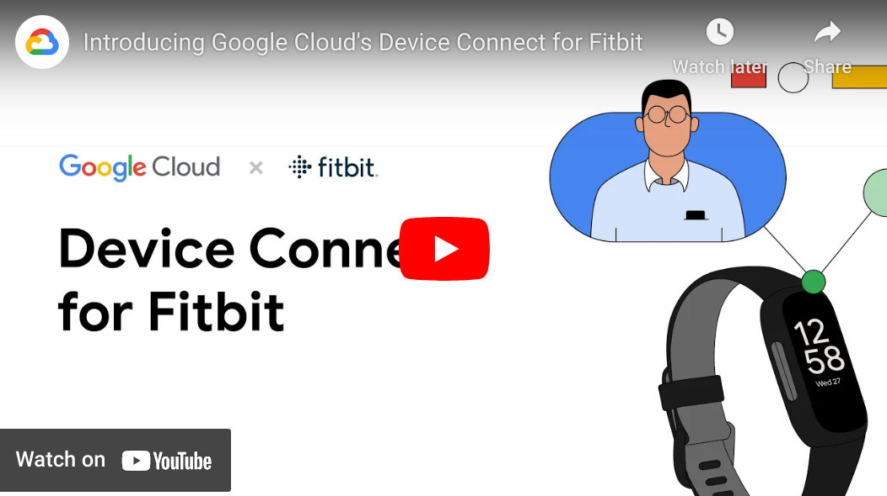

.. raw:: html

`Device Connect for Fitbit`_ uses Google Cloud and `Fitbit web apis`_ to enable
developers to build clinical health applications that leverage data from users'
Fitbit activity trackers.  The tools provided in this repo are open source and build upon
the Google Cloud services.  These tools provide:

  * end-user enrollment, consent management and Fitbit device linking,
  * a data connecter that ingests data from the Fitbit web apis and
    pushes to Cloud BigQuery,
  * looker dashboards for visualizing participants data in specific or
    in aggregate.

Deploy the infrastructure to capture your patient's fitbit data in minutes using 
the provided terraform scripts.  Simply create your GCP project, install terraform,
and run ``terraform apply``.  

The infrastructure uses Cloud Run and Fire Store to manage user enrollment and 
consent; and Cloud BigQuery to store data from the Fitbit webapis.  Once the data
is in BQ, build dashboards with Looker (or other dashboarding tool), and develop 
ML models with AI Notebooks or Vertex AI (tutorials coming).

Dashboards
----------

The Fitbit data provides a unique 360-degree view of the patients' lives and
can be clinically valuable for physicians or health coaches.  It can also 
be integrated with other datasets like EHR data, or other device data.  

Here are some dashboard views that might be valuable:

  * the first view shows overview of stats.  In this case, the patient's Fitbit data
    has been enriched with the date of a past surgury.  It shows the percent of time she is
    wearing the Fitbit device, along with overall statistics.

    .. image:: docs/source/_static/user_overview.png
      :width: 90%
      :alt: user steps dashboard
      :align: center

  * Furter details about steps can also identify potential problems to recovery.

    .. image:: docs/source/_static/user_steps.png
      :width: 90%
      :alt: user steps dashboard
      :align: center

  * and more details about types and range of activity show more details for the 
    clincial teams:

    .. image:: docs/source/_static/user_activity_zones.png
      :width: 90%
      :alt: user steps dashboard
      :align: center

  * or more details on sleep:

     .. image:: docs/source/_static/user_sleep.png
      :width: 90%
      :alt: user steps dashboard
      :align: center

Machine Learning
----------------

While the dashboards can provide valuable insights about the patient's day to day,
more detailed models can be developed that provide both population-level clustering
across a patient population, and more predictive models that can help clinical teams
identify address problems early.

Fine Print
------------

  * First and foremost, *this is not a product!*  there is no support.  This
    is provided as is, with no warrantees, as an example.  Use at your own
    risk.  post issues if you run into any, fork and develop if it is useful
    for your needs.
  
  * By default, the code uses OIDC for user identities (seperate from Fitbit 
    identities).  
    The deployment instructions use `Google OIDC`_ but any OIDC can be
    configured.

  * Data is ingested daily by default (you can configure the Cloud Scheduler
    component, see Terraform scripts).  This
    is not intended for real-time use cases.

.. _Fitbit web apis:
  https://dev.fitbit.com/build/reference/web-api/
.. _Device Connect for Fitbit:
  https://cloud.google.com/device-connect
.. _Google OIDC:
  https://developers.google.com/identity/protocols/oauth2/openid-connect
