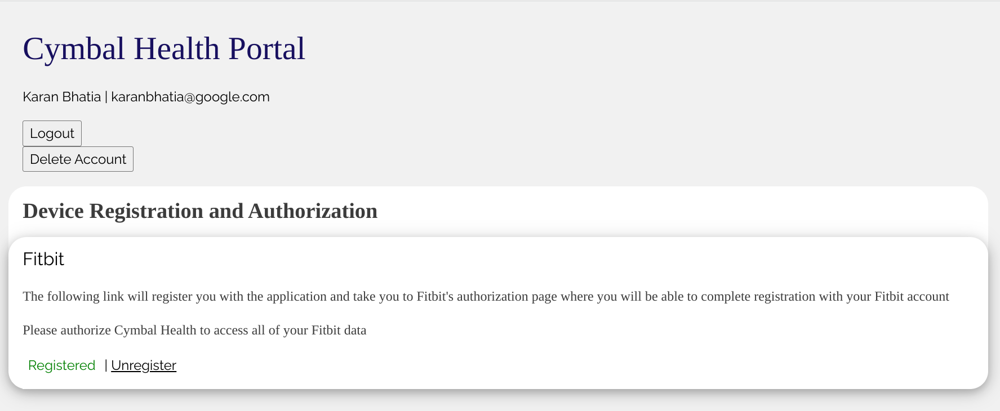

.. _quickstart:

============
Quickstart
============

Requirements
------------

Before you get started, you will need 
the following:

  * Fitbit application credentials
  * an OIDC provider credentials
  * a Google Cloud Platform account and new project
  * (optional) a verified domain
  * some Fitbit users who you can test with

See :any:`requirements` for more details.

You will also need a terminal access and general familiarity with unix/linux systems.

Clone this Repository
---------------------

Fork this repository in your own Github account.

.. image:: _static/github-1.png
  :width: 600
  :alt: fork this repo.

While you are there, might as well star the project as well (thanks!).

.. code:: bash

  git clone https://github.com/GoogleCloudPlatform/deviceconnect.git
  cd deviceconnect

use the url for your forked repository.

Deploy the infrastructure
-------------------------

There are a couple ways to deploy the infrastructure, either manually 
using the Google Cloud console, with terraform scripts, or running in
test mode in vscode.  We describe here the steps 
using terraform as that will be the simplest way to get everything 
deployed.

To make things easier, set your ``PROJECT_ID`` to the gcp project you are using:

.. code:: bash

  export PROJECT_ID=<yourprojectid>

Now login to google cloud and set the `gcloud` default project.

.. code:: bash

  gcloud auth application-default login
  gcloud auth application-default set-quota-project $PROJECT_ID
  gcloud config set project $PROJECT_ID

GCP Foundation Setup - Terraform
~~~~~~~~~~~~~~~~~~~~~~~~~~~~~~~~

Set up Terraform environment variables and GCS bucket for state file.
If the new project is just created recently, you may need to wait for 1-2 minutes
before running the Terraform command.

After installing `gcloud`, change directories to `terraform/environments/dev` and create a 
file called `terraform.tfvars` with the following parameters:

.. code:: bash

  project_id                = # your gcp project id
  admin_email               = # your email
  fitbit_oauth_client_id    = # sign up at dev.fitbit.com for a developer identity
  fitbit_oauth_client_secret= # add your client_id and client_secret here.

  # if you are using google's openid connect server, then you can leave this alone, 
  # otherwise, put in the url for your openid connect provider.
  openid_auth_metadata_url  = "https://accounts.google.com/.well-known/openid-configuration"
  openid_auth_client_id     = # your openid auth client_id
  openid_auth_client_secret = # your openid auth client_secret
  # webapp_domain            = subdomain.domain.com # if you want to run in your custom domain.

Set some more environment variables:

.. code:: bash

  export TF_BUCKET_NAME="${PROJECT_ID}-tfstate"
  export TF_BUCKET_LOCATION="us"

Grant Storage admin to the current user IAM.

.. code:: bash

  export CURRENT_USER=$(gcloud config list account --format "value(core.account)")
  gcloud projects add-iam-policy-binding $PROJECT_ID --member="user:$CURRENT_USER" --role='roles/storage.admin'

Create Terraform Statefile in GCS bucket.

.. code:: bash

  bash setup/setup_terraform.sh

Initialze terraform:

.. code:: bash

  cd terraform/environments/dev
  terraform init -backend-config=bucket=$TF_BUCKET_NAME

Enable GCP services:

.. code:: bash
  
  terraform apply -target=module.project_services -target=module.service_accounts -auto-approve

Run Terraform apply
~~~~~~~~~~~~~~~~~~~

Run the rest of Terraform:

.. code:: bash

  terraform apply -auto-approve

this will enable the needed service apis, deploy the webapps, create the datasets, and
configure the cloud scheduler to ingest data daily.  The output should look something
like:

.. code:: bash

  container = "us-central1-docker.pkg.dev/solution1-373714/cloudrun/queue-image"
  ingest = "https://deviceconnect-ingestion-bnbhqacx5a-uc.a.run.app"
  url = "https://deviceconnect-enrollment-bnbhqacx5a-uc.a.run.app"  

The urls returned are the enrollment and ingestion urls.  Unless you specified 
the ``webapp_domain``, Cloud Run will create the services in the ``run.app`` 
domain.  

Configure the api endpoints
---------------------------

Now that the webapps have been deployed, you may need to adjust the 
api endpoints for Fitbit and OIDC. 

Go to ``http://dev.fitbit.com`` and select "Manage My Apps".  Select
your app and reset the "Redirect URL" to 

.. code:: bash

  https://deviceconnect-enrollment-bnbhqacx5a-uc.a.run.app/services/fitbit/authorized

use the url returned from the terraform.

Similarly in the OIDC configuration (``https://console.developers.google.com/apis/credentials``):
add the following url to the "Authorized redirect URIs":

.. code:: bash

  https://deviceconnect-enrollment-bnbhqacx5a-uc.a.run.app/redirect

Again, use the url returned by the terraform scripts.

Test Enrollment
---------------

Using your Fitbit user, go to the enrollment url:

login with your OIDC identity.  if you are using the Google OIDC, any google identity
will work.

when that works, you will see a default enrollment page with a link to "Register Fitbit".

Click on the link and it will take you to the Fitbit login page.  Once you login, you 
will see the oauth page:

*you must accept all data access*.  If you uncheck any items the enrollment will fail.
(this will be updated soon).  Once accepted, you should see a "Registered". 

At this point the user oauth tokens have been stored in FireStore, and can be used to 
ingest the data.  If you go to the cloud console for FireStore, you will see the 
user tokens stored there.

Test Ingestion
---------------

Now that you have enrolled a user, the data connector can ingest the data from
the Fitbit web apis.  By default, the ingestion webapp (running at the ingest 
url returned by terraform), is only accessible by Cloud Scheduler.  So to 
test the ingestion, go to the console for Cloud Scheduler:

On the "ingest" row, select the three dots on the right and "Force a job run".  
This function will do a simple test to see if the connections are all working. 
If everything is ok, you should see a green checkmark when the function returns.

Once that is done, you can force a run of the other routes. For example, 
"fitbit_activity_pull".  Once that is complete, you should see data in the 
BigQuery dataset:

you should see these tables, and  if you open up the tables, you should 
see data from the day before.

Next steps
----------

Now that the onboarding infrastructure is up and the data connector is able
to pull the data and store into BiqQuery, you can focus on how to generate
insights from this data for your use case.  

  * you can explore the data with a notebook environments, where you can 
    pull the data into pandas dataframes and do statistical modeling or 
    machine learning.

  * load or build clinical dashboards to provide visualization and insights 
    directly to clinical care teams.

  * integrate additional datasets from other devices or from EHR systems
    (for example dates of surgury, clincial diagnosis and treatments, etc)
    to incorporate into the modeling.

  * push insights into EHR systems.
