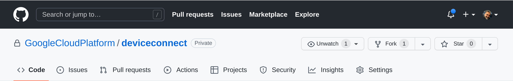

.. _quickstart:

============
Quickstart
============

To deploy software, make sure you have a GCP project, a Fitbit
developer `client-id` and that you have
enabled the various services (Cloud Run, Cloud Firestore, BigQuery).
See :any:`requirements` for more details.

Clone this Repository
---------------------

Fork this repository in your own Github account.

Register application at `dev.fitbit.com`
----------------------------------------

Start at http://dev.fitbit.com/apps and after logging in, register a
new application, providing the details required (you can edit them later).

The most important bits that you need are the `OAUTH 2.0 Client ID`,
the `Client Secret` and the `Redirect URI`.

Don't worry about the Redirect URI for now, just set it to `http://localhost/redirect`
and once we deploy the application, we will updated this to reflect the
url of the applicaiton.

Create OpenID service
---------------------

If you have an patient portal accessible through OpenID Connect, ask the
administrators of the service to create an application for you.  You will
need the following:

  * OPENID_AUTH_METADATA_URL
  * OPENID_AUTH_CLIENT_ID
  * OPENID_AUTH_CLIENT_SECRET

Alternatively, you can use `Google OpenID Connect`_.  Follow instructions on
that page to setup the openid endpoint. Don't worry about the `Redirect URIs`
for now as we will set those up after we deploy the application.

For Google's openid service, the `OPENID_AUTH_METADATA_URL` is
`https://accounts.google.com/.well-known/openid-configuration`.

Deploy on CloudRun
------------------

Create a new GCP project or use an existing project and using the cloud console,
navigate to the CloudRun console.

.. image:: _static/cloudrun-1.png
  :width: 600
  :alt: go to `console.cloud.google.com` and navigate to the Cloud Run service.

We setup a service that is continuously deployed from a source repository.  To
do this, you will need to link your Github or Bitbucket accounts.

Select your Github repository, the one you forked up above.

Use branch `main`, and select the `Dockerfile` option.  The repo has a custom
dockerfile that builds the container.  You may see some alerts to activate
CloudBuild or other services that CloudRun depends on.  Go ahead and enable
those as well.

Set the service connectivity options to allow unauthenticated use, and
allow all traffic to the service.  CloudRun will create the SSL termination
and load balancers as required.

Next, set up the environment variables for the application to use, including
the Fitbit client ids and application configurations.  See :any:`configuration`
for detailed list of variables and their meaning.

.. image:: _static/cloudrun-6.png
  :width: 200
  :alt: set environment parameters.

In addition, add the openid connect variables that you obtained above:

* OPENID_AUTH_METADATA_URL
* OPENID_AUTH_CLIENT_ID
* OPENID_AUTH_CLIENT_SECRET

Finally, hit the start button and let CloudRun build the container and deploy
the application

Set OpenID Redirect URI
-----------------------

Note the URL of the CloudRun service.  It will be something like
`https://deviceconnect-xxxxxxxxxxx.run.app`.  The corresponding openid
redirect URI is:

    `https://deviceconnect-xxxxxxxxxxx.run.app/redirect`

Go back to the `Credentials`_ page and add this setting to the `redirect_uri`.

Set Fitbit Redirect URI
-----------------------

Similarly, the Fitbit application needs to be configured with its own
redirect uri.  Go back to `http://dev.fitbit.com`, edit your application
and add the following to the redirect uri:

    `https://deviceconnect-xxxxxxxxxxx.run.app/services/fitbit/authorized`

Register Users:
---------------

That's it for the configuration.  If everything went well, you can now go
to the url for the application:

    `https://deviceconnect-xxxxxxxxxxx.run.app/`

click the login button, and login using your google identity.

Once logged in, you can link your fitbit device by clicking on the "register"
button.

.. _Google OpenID Connect:
    https://developers.google.com/identity/protocols/oauth2/openid-connect

.. _Credentials:
    https://console.developers.google.com/apis/credentials
