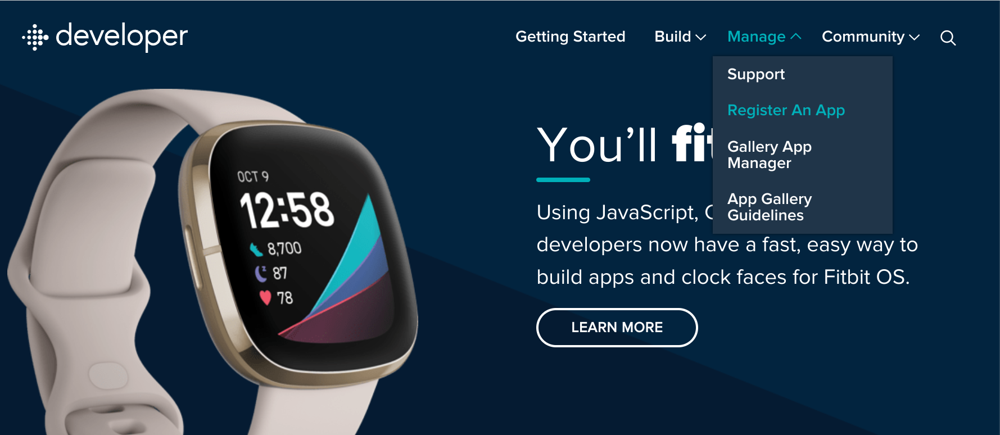

.. _requirements:

============
Requirements
============

In order to get started, you need the following prerequisites:
  * a `Google Cloud Account and Project`_
  * a `Fitbit developer account and application configuration`_
  * an `OpenID Connect application configuration`_

Google Cloud Account and Project
--------------------------------

It is beyond the scope of these docs to setup a GCP account, but you can start
here_.  Your organization may already have a GCP organization setup, in which
case you need to talk with your internal team that manages access to GCP.  

We recommend that you create a new project to host this infrastructure rather
than reuse an existing one.  This way, there is less likelihood of name conflicts,
and its easier to manage access.

Assuming you have your GCP account, then take a look at the docs for `creating 
and managing projects`_.  The TL;DR is:

.. code:: bash

    gcloud projects create PROJECT_ID

.. _here: https://cloud.google.com

.. _creating and managing projects: https://cloud.google.com/resource-manager/docs/creating-managing-projects

Fitbit developer account and application configuration
------------------------------------------------------

Second, you need a Fitbit developer account and application configuration.  Go to 
``https://dev.fitbit.com`` and click on Manage->Register an App.

It may ask you to login with a Fitbit account.  Then in the new application form, 
fill out the various fields:

  * application name: whatever name you want, eg. Cymbal Health - Device Connect
  * description: add a short description of the project, eg: Device connect for fitbit
  * application website url: use your organization's top-level url, eg, http://www.cymbal-health.org
  * organization: your organization name, eg: Cymbal Health
  * terms of service url: add url if you have it, or just your top level domain
  * privacy policy url: add url or just your top level domain
  * OAuth 2.0 application type:  select *server*
  * redirect url:  for now, you can just submit "http://localhost:5000/services/fitbit/authorized", we
    will change his once the application is deployed.
  * default access type: select "read only"

Once entered, hit "save" and you should see the application listed in the "Manage my apps" tab.
Click on the app and you will find the "OAuth2.0 Client ID" and "Client Secret".  Note these 
two values as they will be needed for setting up the Device Connect infrastructure.

.. Note::
    Intraday data for heartrate, breathing, and activity data are not
    available by default.  see
    https://dev.fitbit.com/build/reference/web-api/intraday/ to request
    access for your production and/or development service accounts.

OpenID Connect application configuration
----------------------------------------

Next, you need some OpenID Connect identity provider.  You can use any OIDC provider
that conforms to the OIDC protocol.  Here we use the `Google OIDC provider`_, and
specifically follow the instructions in the `Obtain OAuth2.0 credentials`_ section.

.. _Obtain OAuth2.0 credentials: https://developers.google.com/identity/openid-connect/openid-connect#getcredentials

.. _Google OIDC provider: https://developers.google.com/identity/openid-connect/openid-connect

  * application type: set to "Web application"
  * authorized javascript origins:  leave it blank (not needed)
  * authorized redirect urls: for now, just set to "https://localhost:8080/redirect".  we will
    change this once the web apps are deployed.

Copy the client id and client secret.  You will need those to configure the onboarding webapp.