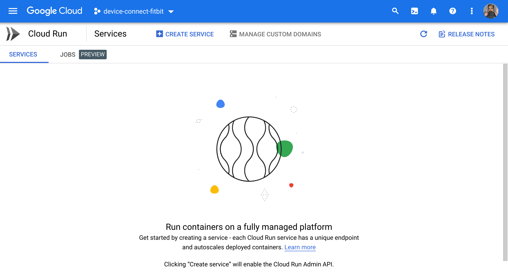
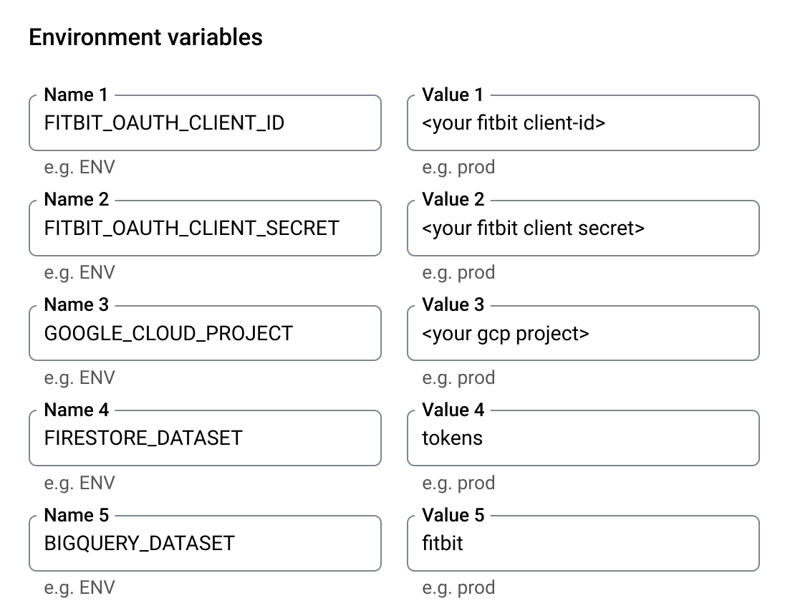

======================
Developer Installation
======================

There are a number of ways to install this software.

Developer installation via virtualenv
=====================================

If you want to run it locally on your development system, typically
because you are developing and testing the code, then follow these
instructions.

* install `virtualenv` and install package dependencies:

    The dependencies are specified in the `requirements.txt` file
    at the root of the repository.

    Create a new virtual environment (optional but recommended) and
    run::

        virtualenv venv --python=python3
        . venv/bin/activate
        pip install -r requirments.txt

    The code assumes python version 3.10, see `Dockerfile` for details.

    create a file `.env` that has the following environment variables::

        GOOGLE_APPLICATION_CREDENTIALS="<path to json file>"
        GOOGLE_CLOUD_PROJECT = '<your gcp project id>'
        FITBIT_OAUTH_CLIENT_ID = '<your clientid>'
        FITBIT_OAUTH_CLIENT_SECRET = '<your client secret>'
        FITBIT_OAUTH_REDIRECT_URL = 'https://your.domain.com/path'

    Finally start the service with::

        flask run

    the application will run and show something like the following::

        * Serving Flask app 'app/app' (lazy loading)
        * Environment: development
        * Debug mode: on
        * Running on http://127.0.0.1:5000 (Press CTRL+C to quit)
        * Restarting with stat
        * Debugger is active!
        * Debugger PIN: 683-409-059

    Point your browser to the link from above to test the application.

Developer Installation using VSCode
===================================

If you use vscode, the provided devcontainer specification
will install the dpendencies automatically.  See
`dev containers <https://code.visualstudio.com/docs/remote/containers>`

Devcontainers are supported with vscode.dev and will automatically
configure a development container.

This container-based
development environment is defined by two files in `.devcontainer/`:
a `Dockerfile` that defines the base container, and a `devcontainer.json`
that configures the vscode environment.

Docker
======

The application comes with a `Dockerfile` for building a containerized
version of the application.

.. literalinclude:: ../../Dockerfile
   :language: dockerfile

To build the container with Docker, simply::

    docker build .
    Successfully built 24c5457776b4

You can use docker commandline tool to determine the size of the container::

    docker image ls | grep 24c5457776b4
    24c5457776b4   14 minutes ago   168MB

and you can run the container using::

    docker run 24c5457776b4

To deploy the container in a runtime, the environment variables defined in
`.env` must be defined in the runtime environment for the container.
For example, running the docker container on the commandline will work if
you create an `.env-docker` file such as::

    GOOGLE_CLOUD_PROJECT=<snip>
    FITBIT_OAUTH_CLIENT_ID=<snip>>
    FITBIT_OAUTH_CLIENT_SECRET=<snip>
    FITBIT_OAUTH_REDIRECT_URL=http://127.0.0.1/services/fitbit/authorized
    OAUTHLIB_INSECURE_TRANSPORT=true
    GOOGLE_APPLICATION_CREDENTIALS=<path to service account json file>

Once you have the variables defined in bash format, run the docker container::

    docker run --env-file .env-docker -p 5000:5000 24c5457776b4

where the last parameter is the container id.

Cloud Build
===========

use the command::

    gcloud builds submit --region=us-central1 --tag gcr.io/<gcp_project>/<containername>:<tag>

This will upload the source material to gcp and use the `Dockerfile` to build and
register the container in gcr.  Once built, you can run it using regular docker
commands or with CloudRun.

Deploy on CloudRun
==================

Create a new GCP project or use an existing project and using the cloud console,
navigate to the CloudRun console.

We setup a service that is continuously deployed from a source repository.  To
do this, you will need to link your Github or Bitbucket accounts.

.. image:: _static/cloudrun-2.png
  :width: 600
  :alt: create a new service from a source repository.

Select your Github repository, the one you forked up above.

.. image:: _static/cloudrun-3.png
  :width: 600
  :alt: select your github repo.

Use branch `main`, and select the `Dockerfile` option.  The repo has a custom
dockerfile that builds the container.  You may see some alerts to activate
CloudBuild or other services that CloudRun depends on.  Go ahead and enable
those as well.

.. image:: _static/cloudrun-4.png
  :width: 600
  :alt: select the repo options.

Set the service connectivity options to allow unauthenticated use, and
allow all traffic to the service.  CloudRun will create the SSL termination
and load balancers as required.

.. image:: _static/cloudrun-5.png
  :width: 200
  :alt: select service connectivity options.

Next, set up the environment variables for the application to use, including
the Fitbit client ids and application configurations.  See :any:`configuration`
for detailed list of variables and their meaning.

In addition, add the openid connect variables that you obtained above:

* OPENID_AUTH_METADATA_URL
* OPENID_AUTH_CLIENT_ID
* OPENID_AUTH_CLIENT_SECRET

Finally, hit the start button and let CloudRun build the container and deploy
the application

.. image:: _static/cloudrun-7.png
  :width: 50
  :alt: select the repo options.

Set OpenID Redirect URI
-----------------------

Note the URL of the CloudRun service.  It will be something like
`https://deviceconnect-xxxxxxxxxxx.run.app`.  The corresponding openid
redirect URI is:

    `https://deviceconnect-xxxxxxxxxxx.run.app/redirect`

Go back to the application page and add this setting to the `redirect_uri`.

Set Fitbit Redirect URI
-----------------------

Similarly, the Fitbit application needs to be configured with its own
redirect uri.  Go back to `http://dev.fitbit.com`, edit your application
and add the following to the redirect uri:

    `https://deviceconnect-xxxxxxxxxxx.run.app/services/fitbit/authorized`

